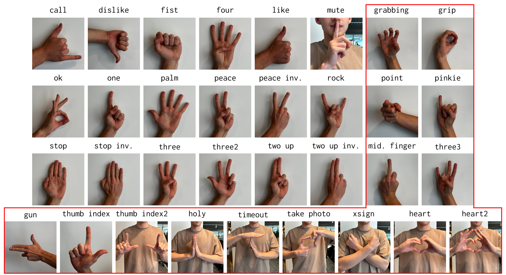
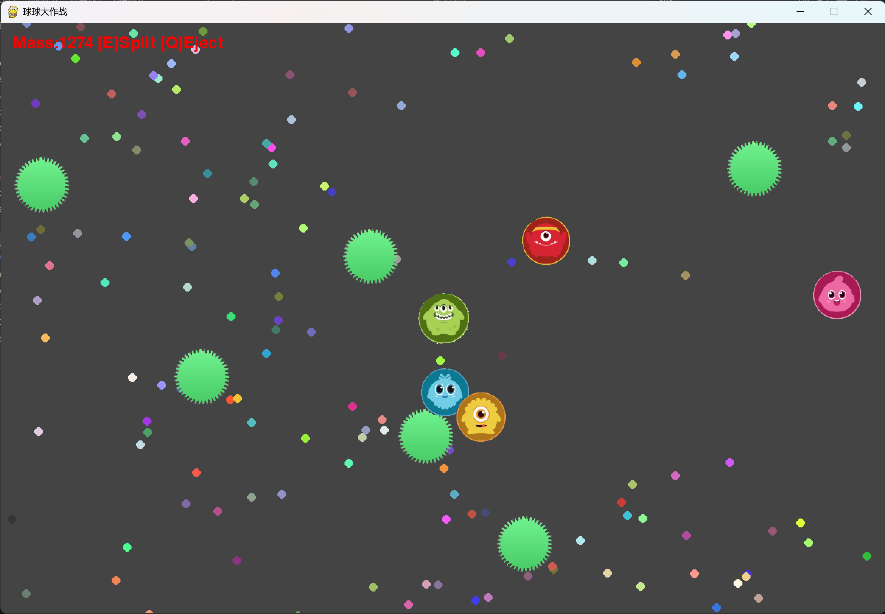
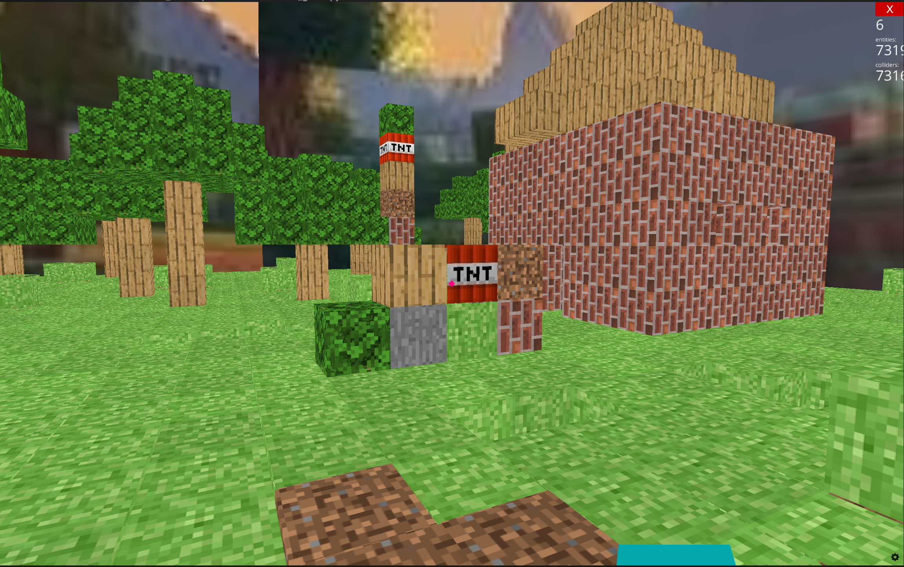

# Part1说明文档
- 2351289周慧星
## 一、项目概述
本项目包含两个不同的小游戏及一个手势识别模块，涵盖了多种技术的应用，包括计算机视觉、深度学习和游戏开发。具体内容如下：
1. **手势识别模块**：使用深度学习模型 ResNet152 对摄像头捕捉的手势进行实时识别。
2. **球球大作战游戏**：基于 Pygame 开发的休闲游戏，玩家可以控制小球移动、分裂和吐球，吞噬其他小球和食物来变大。
3. **我的世界风格游戏**：使用 Ursina 引擎创建的 3D 沙盒游戏，玩家可以在游戏中建造和破坏方块，生成地形、房屋和树木。

## 二、项目结构
```
project/
├── gesture_recognition.py  # 手势识别脚本
├── ball_game.py            # 球球大作战游戏脚本
├── Minecraft_game.py       # 我的世界风格游戏脚本
```

## 三、环境要求
### 依赖库
- **OpenCV**：用于摄像头视频捕捉和图像处理。
- **PyTorch**：深度学习框架，用于加载和运行手势识别模型。
- **Torchvision**：提供预训练模型和图像变换工具。
- **Pygame**：用于开发球球大作战游戏。
- **Ursina**：用于开发我的世界风格游戏。
- **PerlinNoise**：用于生成我的世界游戏中的地形。
- **Pillow**：用于图像处理。
- **NumPy**：用于数值计算和数组操作。

### 安装依赖
```bash
pip install opencv-python torch torchvision pygame ursina perlin-noise pillow numpy
```

## 四、使用说明

### 手势识别模块
运行 `gesture_recognition.py` 脚本，将打开摄像头并实时识别手势。确保模型文件 `resnet152.pth` 在models目录下。
```bash
python gesture_recognition.py
```
识别的手势类别包括：
```
["grabbing", "grip", "holy", "point", "call", "three3", "timeout", "xsign",
"hand_heart", "hand_heart2", "little_finger", "middle_finger", "take_picture",
"dislike", "fist", "four", "like", "mute", "ok", "one", "palm", "peace",
"peace_inverted", "rock", "stop", "stop_inverted", "three", "three2",
"two_up", "two_up_inverted", "three_gun", "thumb_index", "thumb_index2",
"no_gesture"]
```


### 球球大作战游戏
运行 `ball_game.py` 脚本，启动游戏。
```bash
python ball_game.py
```
- **游戏操作**：
  - **鼠标移动**：控制小球移动方向。
  - **E 键**：分裂小球。
  - **Q 键**：吐球。
  - **ESC 键**：退出游戏。



### 我的世界风格游戏
运行 `Minecraft_game.py` 脚本，启动游戏。
```bash
python Minecraft_game.py
```
- **游戏操作**：
  - **WASD 键**：移动。
  - **空格键**：跳跃。
  - **鼠标左键**：放置方块。
  - **鼠标右键**：破坏方块。
  - **数字键 1 - 7**：选择不同类型的方块。
  - **ESC 键**：退出游戏。


