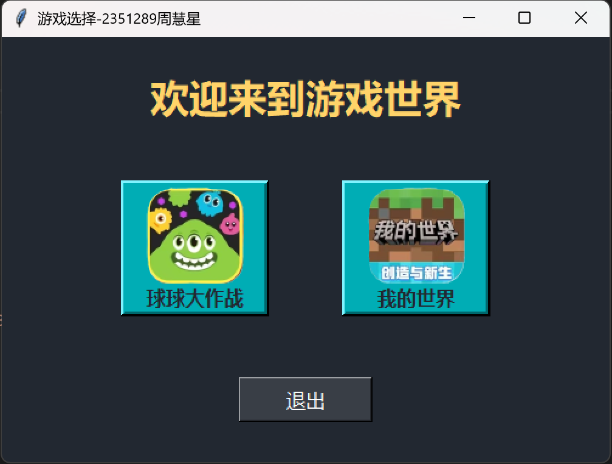
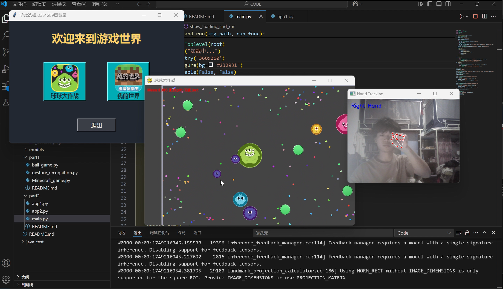
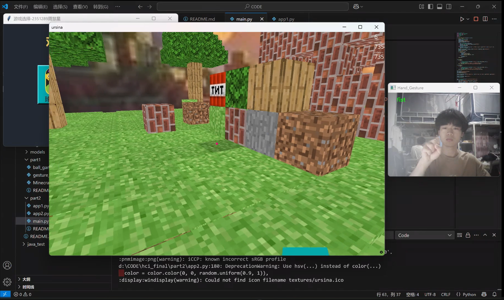

# part2手势控制游戏集合
- 2351289周慧星

## 项目简介

part2是一个基于Python的游戏集合，实现了**手势控制游戏**和**手势识别演示**。主要包含：
- 一款2D“球球大作战”类游戏，可用手势和键盘控制。
- 一款3D“我的世界”沙盒世界，同样支持键盘/鼠标和手势控制。
- 一个统一的图形化启动器，便于选择和启动游戏。

手势识别基于计算机视觉和深度学习，用户可通过摄像头用手势自然地操作游戏。

---

## 目录结构

```
hci_final/
│
├── Assets/                 # 各类游戏与启动器图片/音频资源
│   ├── app/                # 启动器和按钮图片
│   ├── ball/               # 球球大作战资源
│   └── minecraft/          # 我的世界资源
├── models/
│   └── ResNet152.pth       # 手势识别预训练模型
├── part2/
│   ├── app1.py             # 手势版球球大作战
│   ├── app2.py             # 手势版我的世界
│   ├── main.py             # 图形化启动器
```

---

## 安装依赖
在运行本项目之前，需要安装以下Python库：
```bash
pip install ursina opencv-python torch torchvision mediapipe pygame pyautogui perlin_noise pillow
```

## 运行步骤
1. 运行主程序：
```bash
python main.py
```
2. 在弹出的主界面中，选择你想要玩的游戏。点击“球球大作战”或“我的世界”按钮，游戏将开始加载。
3. 游戏加载完成后，即可开始游戏。在游戏过程中，你可以使用手势来控制角色的移动、操作等。


## 游戏说明

### 球球大作战（app1.py）
- **游戏目标**：控制小球吃掉地图上的食物和其他小球，不断增大自己的体积，成为最大的球。
- **手势控制**：
  - 右手控制鼠标移动。
  - 仅食指伸直（1手势）：相当于按下键盘的 `Q` 键，吐球。
  - 食指与中指伸直（2手势）：相当于按下键盘的 `E` 键，分裂。
- **键盘控制**：
  - `Q` 键：吐球。
  - `E` 键：分裂。
  - `Esc` 键：退出游戏。


### 我的世界（app2.py）
- **游戏目标**：在一个虚拟世界中进行建造、探索和生存。
- **手势控制**：
  - `one`（19）：相当于按下键盘的 `W` 键，向前移动。
  - `peace`（21）：相当于按下键盘的 `S` 键，向后移动。
  - `palm`（20）：相当于按下键盘的 `A` 键，向左移动。
  - `four`（15）：相当于按下键盘的 `D` 键，向右移动。
  - `ok`（18）：相当于按下键盘的 `Space` 键，跳跃。
  - `grip`（1）：相当于按下键盘的 `1` 键，选择草方块。
  - `holy`（2）：相当于按下键盘的 `2` 键，选择石头方块。
  - `point`（3）：相当于按下键盘的 `3` 键，选择砖块方块。
  - `call`（4）：相当于按下键盘的 `4` 键，选择泥土方块。
  - `three3`（5）：相当于按下键盘的 `5` 键，选择木头方块。
  - `timeout`（6）：相当于按下键盘的 `6` 键，选择TNT方块。
  - `xsign`（7）：相当于按下键盘的 `7` 键，选择树叶方块。
- **键盘控制**：
  - `W`、`A`、`S`、`D` 键：控制角色移动。
  - `Space` 键：跳跃。
  - `1` - `7` 键：选择不同的方块。
  - `鼠标左键`：放置方块。
  - `鼠标右键`：破坏方块。
  - `Esc` 键：退出游戏。


## 扩展与定制
- **添加新手势**：  
  可自行在`app2.py`的`gesture_to_key`字典中，将新手势编号与游戏动作绑定。
- **更换资源**：  
  替换或新增`Assets`目录下的图片、音频等，按需修改路径。
- **调整游戏参数**：  
  各.py文件内可调整AI数量、食物数量、地图大小等参数。