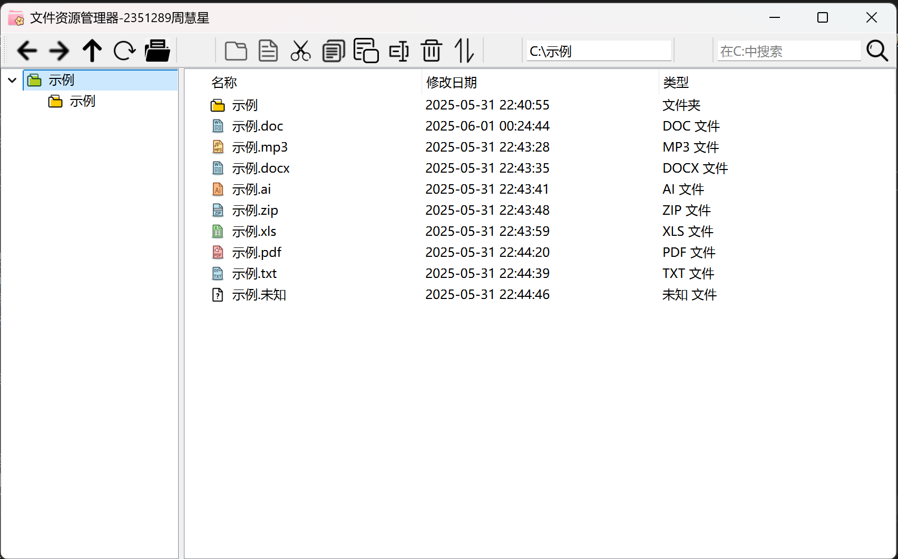

# 文件资源管理器
- 2351289周慧星

本项目是一个基于 Qt 的虚拟文件资源管理器，支持类似于 Windows 资源管理器的文件夹树、文件列表视图以及常见的文件操作（新建、删除、重命名、剪切、复制、粘贴、排序、搜索、编辑文件内容等）。

## 功能特性

- **左侧树形视图**：只显示文件夹，可方便浏览虚拟目录结构。
- **右侧列表视图**：显示当前目录下的所有文件和文件夹，支持多选。
- **文件操作**：
  - 支持Shift和Ctrl多选文件夹和文件
  - 新建文件/文件夹
  - 删除
  - 重命名
  - 剪切、复制、粘贴（支持多选）
  - 排序（按名称、修改时间、类型进行升/降序）
  - 搜索（支持递归模糊搜索）
- **文件编辑**：双击文件或点击打开按钮，支持通过对话框编辑文本文件内容，支持保存、关闭时提示保存。
- **路径导航**：支持上级、后退、前进。
- **虚拟文件系统持久化**：自动保存和加载虚拟文件系统到本地 JSON 文件。
- **美观的图标显示**：不同类型文件有不同图标。

## 项目结构

- `main.cpp`        —— 程序入口
- `mainwindow.h/cpp`—— 主窗口及核心逻辑
- `vfilesystem.h`   —— 虚拟文件系统的数据结构（VNode）
- `vfilesystemmodel.h/cpp` —— Qt Model，用于树视图/List视图的数据支撑
- `fileeditdialog.h`—— 文件编辑对话框
- `icons/`          —— 各类图标
- `data.json`       —— 自动保存的虚拟文件系统数据

## 编译与运行

### 程序运行
1. 打开我打包的Release文件夹，找到 `os3-FileSystem.exe`。
2. 点击运行即可，结果会保存至`data.json`。

### 编译步骤
- **Qt 6.5.3** 及以上（建议使用 MSVC 2019 64bit 版本）
- C++17 编译器
1. 使用 Qt Creator 或命令行打开项目。
2. 选择合适的 Qt Kit（例如 MSVC2019_64）。
3. 编译并运行。

## 使用说明

- **新建/删除/重命名/剪切/复制/粘贴/排序/搜索/打开文件**等操作可通过工具栏按钮、右键菜单或快捷键进行。
- **文件夹树只显示目录**，右侧列表显示当前目录下全部内容。
- 编辑文件内容后请及时保存，否则关闭会有保存提示。
- 虚拟文件系统数据保存在程序目录下的 `data.json`，每次关闭程序自动保存。
