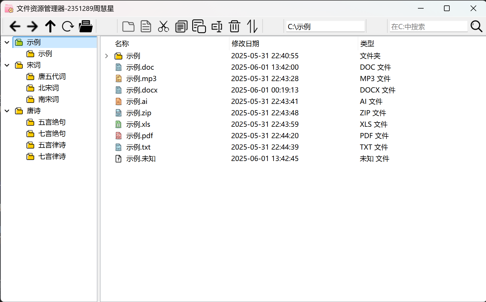

# 文件资源管理器
- 2351289周慧星

本项目是一个基于 Qt 的虚拟文件资源管理器，支持类似于 Windows 资源管理器的文件夹树、文件列表视图以及常见的文件操作（新建、删除、重命名、剪切、复制、粘贴、排序、搜索、编辑文件内容等）。

## 界面与功能

### 界面简介

- **左侧**：仅显示文件夹的多级目录树（TreeView），便于层次导航
- **上部**：路径显示栏，直观展示当前目录层级
- **右侧**：当前目录下文件与文件夹的详细列表（ListView），支持多列显示与多选
- **顶部工具栏**：集成新建、删除、重命名、剪切/复制/粘贴、排序、搜索、导航等操作按钮

### 文件管理功能
- **左侧树形视图**：只显示文件夹，可方便浏览虚拟目录结构。
- **右侧列表视图**：显示当前目录下的所有文件和文件夹，支持多选。
- **文件操作**：
  - 支持Shift和Ctrl多选文件夹和文件
  - 新建文件/文件夹
  - 删除
  - 重命名
  - 剪切、复制、粘贴（支持多选）
  - 排序（按名称、修改时间、类型进行升/降序）
  - 搜索（支持递归模糊搜索）
- **文件编辑**：双击文件或点击打开按钮，支持通过对话框编辑文本文件内容，支持保存、关闭时提示保存。
- **路径导航**：支持上级、后退、前进。
- **虚拟文件系统持久化**：自动保存和加载虚拟文件系统到本地 JSON 文件。
- **美观的图标显示**：不同类型文件有不同图标。

本系统核心功能紧扣操作系统中文件管理知识点，通过以下主要函数实现：

| 函数                  | 功能描述                              | 知识点应用                                       |
|----------------------|---------------------------------------|------------------------------------------------|
| onNew(bool isDir)    | 新建文件或文件夹，防止同目录重名      | 多级目录/文件名管理，目录结构维护               |
| onDelete()           | 删除选中文件/文件夹（支持多选递归）   | 递归树结构删除，内存管理，目录项更新             |
| onRename()           | 重命名文件/文件夹，检查重名           | 目录项属性修改，重名检测                        |
| onCutOrCopy()     | 剪切/复制选中文件或文件夹             | 目录树节点移动/克隆，剪贴板管理                 |
| onPaste()            | 粘贴到当前目录，递归移动/复制结构     | 目录树合并，节点父子关系维护                    |
| onSort()             | 按名称/时间/类型排序，升降序可选      | 目录项属性排序，排序算法应用                    |
| onSearch()           | 支持多级目录递归模糊查找文件/文件夹   | 目录项遍历，字符串匹配                          |
| onOpenFile()         | 打开并编辑文本文件内容                | 文件内容读取/写入，文件属性更新时间             |
| onBack()/onForward()/onUp() | 导航历史/上级目录              | 路径管理，导航栈实现                            |
| saveVFS()/loadVFS()  | 启动/关闭时自动持久化虚拟文件系统     | 文件系统序列化/反序列化，数据持久化             |

> 相关辅助函数如 `updateListView()`、`updatePathEdit()`、`recursiveMatch()` 等，保证界面与数据实时同步。

## 主要界面与功能截图

| 操作           | 截图示例                       |
|----------------|-------------------------------------|
| 新建文件夹     |   |
| 文件重命名     |       |
| 剪切/粘贴      |        |
| 文件编辑       |        |
| 排序/搜索      |     |

## 项目结构

- `main.cpp`        —— 程序入口
- `mainwindow.h/cpp`—— 主窗口及核心逻辑
- `vfilesystem.h`   —— 虚拟文件系统的数据结构（VNode）
- `vfilesystemmodel.h/cpp` —— Qt Model，用于树视图/List视图的数据支撑
- `fileeditdialog.h`—— 文件编辑对话框
- `icons/`          —— 各类图标
- `data.json`       —— 自动保存的虚拟文件系统数据

## 编译与运行

### 程序运行
1. 打开我打包的Release文件夹，找到 `os3-FileSystem.exe`。
2. 点击运行即可，结果会保存至`data.json`。

### 编译步骤
- **Qt 6.5.3** 及以上（建议使用 MSVC 2019 64bit 版本）
- C++17 编译器
1. 使用 Qt Creator 或命令行打开项目。
2. 选择合适的 Qt Kit（例如 MSVC2019_64）。
3. 编译并运行。

## 使用说明

- **新建/删除/重命名/剪切/复制/粘贴/排序/搜索/打开文件**等操作可通过工具栏按钮、右键菜单或快捷键进行。
- **文件夹树只显示目录**，右侧列表显示当前目录下全部内容。
- 编辑文件内容后请及时保存，否则关闭会有保存提示。
- 虚拟文件系统数据保存在程序目录下的 `data.json`，每次关闭程序自动保存。
