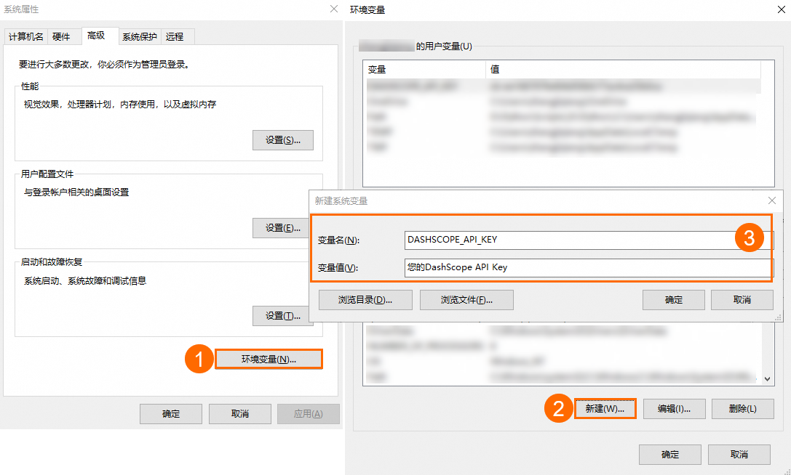
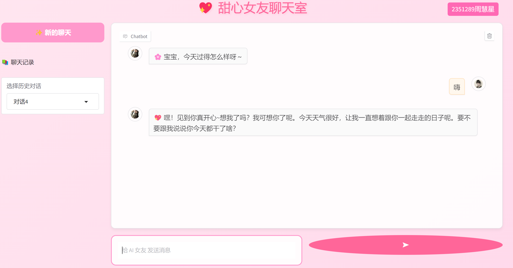

# 运行app.py说明
## 一、前提条件
### （一）Python环境
确保系统中已安装Python，推荐使用Python 3及以上版本。这是因为较新版本的Python具备更稳定的性能和更丰富的特性，能够更好地支持`app.py`中所使用的各类库。

### （二）API密钥获取
本`app.py`使用通义千问（Qwen）模型API，所有运行前请确保你有API，获取API密钥的步骤如下：
1. **登录平台**：访问阿里云百炼大模型服务平台（https://modelscope.cn/ ）。
2. **获取API Key：** 前往我的API-KEY页面，单击创建我的API-KEY。 在已创建的API Key操作列，单击查看，获取API KEY。

## 二、安装依赖库
我们将利用`pip`包管理器来安装`app.py`运行所需的Python库。安装依赖库的具体步骤如下：
1. 打开命令行工具：
    - 在Windows系统中，可以通过“开始菜单”搜索并打开“命令提示符”或“PowerShell”。
    - 在Linux和macOS系统中，打开“终端”应用程序。
2. 在命令行中输入以下命令来安装所需的库：
```bash
pip install gradio openai json os typing
```

## 三、运行应用程序
### （一.1）设置环境变量
在运行`app.py`之前，需要将获取到的API密钥设置为环境变量。不同操作系统设置环境变量的方法有所不同，具体如下：
1. **Linux和macOS系统**：打开终端，在终端中输入以下命令（请将`your_api_key`替换为您实际获取到的API密钥）：
```bash
export DASHSCOPE_API_KEY='your_api_key'
```
2. **Windows系统**：
    - 右键点击“此电脑”图标，在弹出的菜单中选择“属性”选项。
    - 在打开的“系统属性”窗口中，点击“高级系统设置”按钮。
    - 在弹出的“系统属性”对话框中，切换到“高级”选项卡，然后点击下方的“环境变量”按钮。
    - 在“系统变量”区域中，点击“新建”按钮。
    - 在“新建系统变量”对话框中，“变量名”处输入“DASHSCOPE_API_KEY”，“变量值”处输入您实际获取到的API密钥。
    - 点击“确定”按钮保存设置，关闭所有打开的窗口。
   
    - 打开CMD（命令提示符）窗口执行如下命令检查环境变量是否生效。
    - CMD查询命令：
   ```bash
      echo %DASHSCOPE_API_KEY%
      ```
    - Windows PowerShell查询命令：
   ```bash
      echo $env:DASHSCOPE_API_KEY
      ```
### （一.2）如果未设置环境变量
如果你不想设置环境变量，可以找到app.py的一下代码部分
```bash
#调用API
client = openai.OpenAI(
    api_key=os.getenv("DASHSCOPE_API_KEY"),
    base_url="https://dashscope.aliyuncs.com/compatible-mode/v1",  # 使用阿里云大模型 API
)
 ```
将"DASHSCOPE_API_KEY"替换为你自己的API密钥。
### （三）更换LLM模型
本app.py使用的是model="qwen-turbo"模型，如果你想用别的LLM模型，请将代码中所有的的以下部分替换：
```bash
model="qwen-turbo"
```
将"qwen-turbo"替换为别的模型，比如
```bash
model="deepseek-v3"
```
但请确保阿里云百炼平台有该模型，你可点击“ https://bailian.console.aliyun.com/?tab=model#/model-market ” 查看有哪些模型。

### （三）启动应用
请确保app.py、README.md、girl.png、user.png、img.png、img1.png在同一目录下。
- 完成环境变量设置后，接下来启动应用程序：
1. 打开命令行工具。
2. 使用`cd`命令导航到`app.py`文件所在的目录。例如，如果`app.py`文件存放在“C:\my_project”目录下，在Windows系统的命令行中输入：
```bash
cd C:\my_project
```
在Linux和macOS系统的终端中，假设`app.py`位于“/Users/your_username/my_project”目录下，则输入：
```bash
cd /Users/your_username/my_project
```
3. 进入`app.py`所在目录后，在命令行中运行以下命令启动应用程序：
```bash
python app.py
```
- 或者你可以在IDE环境中打开app.py运行。

### （四）访问应用
- 应用程序成功启动后，命令行中会显示一个链接，通常类似“http://127.0.0.1:7860”。如果你想To create a public link, 可以set `share=True` in `launch()`.
- 复制该链接，然后将其粘贴到网页浏览器的地址栏中，按下回车键，即可访问“甜心女友聊天室”应用。你将看到：

- 在应用界面中，您可以进行以下操作：
1. **聊天交互**：在输入框中输入您想要发送的消息，然后点击“➤”按钮，或者直接在输入框中按下回车键，即可将消息发送给AI女友并获取回复。
2. **开始新对话**：如果您想要开始一段新的聊天对话，可以点击“✨ 新的聊天”按钮，这样会清除当前的聊天记录，开始全新的对话。
3. **查看和继续历史对话**：通过页面上的下拉菜单，您可以选择之前的聊天历史记录。选择后，即可继续之前的聊天，方便回顾之前的交流内容。 