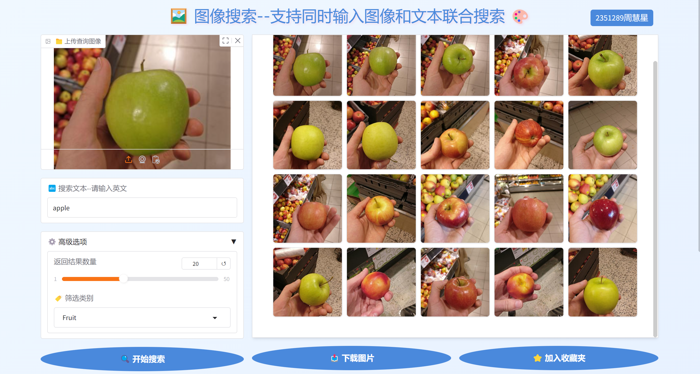
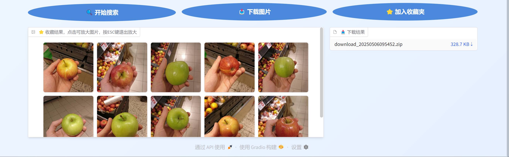

# 图像搜索系统
- 作者： 2351289周慧星
- 本项目是一个基于 CLIP模型的图像搜索系统，支持通过图像和文本联合搜索图像。系统使用 Upstash Vector 作为向量数据库来存储图像特征向量，并通过 Gradio 构建了一个交互式的 Web 界面。

## 功能概述
- 🔍 **多模态搜索**：支持图像搜索、文本搜索以及图像+文本联合搜索
- 🏷️ **分类筛选**：可按预设类别筛选搜索结果
- ⭐ **收藏功能**：可保存喜欢的图片到收藏夹
- 📥 **批量下载**：支持将搜索结果或收藏内容打包下载为ZIP文件
- 🎨 **美观界面**：采用Gradio构建的现代化交互界面
- 
- 
## 环境准备
### 安装依赖
确保你已经安装了 Python 3.7 或更高版本，并使用以下命令安装所需的依赖库：
```bash
pip install pillow clip upstash-vector tqdm gradio numpy torch zipfile
```

### 配置环境变量
你需要设置两个环境变量：`UPSTASH_URL` 和 `UPSTASH_TOKEN`，用于连接 Upstash Vector 数据库。可以在命令行中设置，或者在 `.env` 文件中添加以下内容：
```plaintext
UPSTASH_URL=your_upstash_url
UPSTASH_TOKEN=your_upstash_token
```
为了方便，给出我已经上传好的Upstash Vector 数据库,直接替换代码相应部分即可。
```bash
# 配置环境
UPSTASH_URL = "https://included-gator-34186-us1-vector.upstash.io"
UPSTASH_TOKEN = "ABgFMGluY2x1ZGVkLWdhdG9yLTM0MTg2LXVzMWFkbWluTUdFeVpHVTFOamt0TTJRMFlTMDBOelUyTFRsa09UVXRPV1JpTmpBeVkySTJPVE0z"
```

### 数据集准备
将你的图像数据集放在 `dataset/` 目录下，确保每个子目录代表一个图像类别。例如：
```
dataset/
├── Fruit/
│   ├── apple.jpg
│   ├── banana.jpg
│   └── ...
├── Packages/
│   ├── box1.jpg
│   ├── box2.jpg
│   └── ...
└── Vegetables/
    ├── carrot.jpg
    ├── tomato.jpg
    └── ...
```
我会给出我的`dataset/` 目录文件。

## 代码结构
- `image_process.py`：用于遍历数据集，提取图像特征向量，并将其存储到 Upstash Vector 数据库中。
- `image_search.py`：构建 Gradio 界面，实现图像搜索、收藏和下载功能。

## 使用方法
### 1. 预处理图像数据
运行 `image_process.py` 脚本来提取图像特征向量并存储到数据库中（如果你用我的数据库，这一步可以跳过）：
```bash
python image_process.py
```

### 2. 启动图像搜索界面
运行 `image_search.py` 脚本来启动 Gradio 界面：
```bash
python image_search.py
```

### 3. 进行图像搜索
- 打开浏览器，访问 `http://127.0.0.1:7860`（默认地址，输出结果会有）。
- 上传查询图像或输入搜索文本，也可以同时使用两者进行联合搜索。
- 调整高级选项，如返回结果数量和筛选类别。
- 点击“开始搜索”按钮，系统将返回最相关的图像。

### 4. 收藏和下载图像
- 点击“加入收藏夹”按钮，将搜索结果中的图像添加到收藏夹中。
- 点击“下载图片”按钮，将搜索结果或收藏夹中的图像下载为 ZIP 文件。

## 注意事项
- 搜索文本请使用英文，因为 CLIP 模型在英文文本上有更好的表现。
- 如果数据集路径不存在，`image_process.py` 脚本将抛出 `FileNotFoundError` 异常，请检查路径是否正确。
- 如果 `UPSTASH_URL` 或 `UPSTASH_TOKEN` 未设置，脚本将抛出 `ValueError` 异常，请确保环境变量已正确配置。
